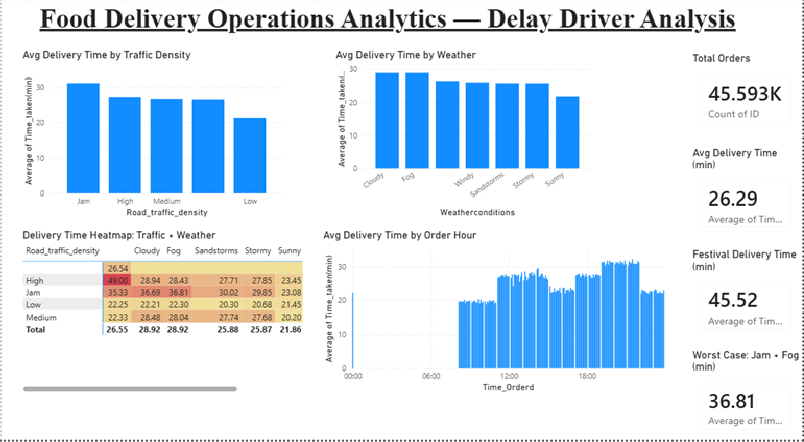
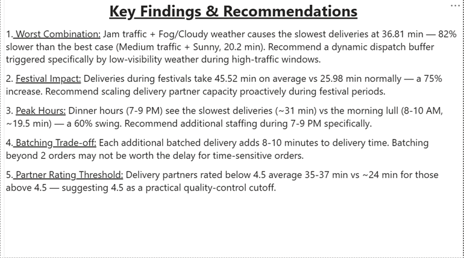

# Food Delivery Operations Analytics — Delay Driver Analysis

An end-to-end data analytics project identifying the operational factors that drive delivery delays, using a real-world food delivery dataset. Built as a full **Excel → SQL → Power BI** pipeline to simulate a realistic ops-analytics workflow.

## Business Question

Which combination of traffic, weather, and time-of-day conditions causes the worst delivery delays — and what specific operational change would reduce them?

## Tools & Workflow

| Stage | Tool | What was done |
|---|---|---|
| Initial inspection & cleanup | Excel | Removed placeholder/malformed text values |
| Data cleaning & transformation | SQL (SQLite, DB Browser) | Converted fake "NaN" text to true NULLs, trimmed whitespace, stripped embedded text from numeric fields (e.g. "(min) 24" → 24), converted data types |
| Analysis | SQL | 9+ queries answering specific business questions across traffic, weather, city type, festivals, batching, time-of-day, and delivery partner ratings |
| Dashboard & visualization | Power BI | 2-page interactive dashboard: KPI cards, comparison charts, and a color-coded heatmap |

## Dataset

**Food Delivery Dataset** (Kaggle, ~45,600 records) — includes delivery person details, weather conditions, road traffic density, order timestamps, vehicle type, and delivery time, across multiple Indian cities.

The raw data required substantial cleaning: missing values were stored as literal text ("NaN ") rather than true blanks, weather values had a redundant "conditions " prefix, and the target time column was mixed text/number ("(min) 24"). This cleaning work is documented step-by-step in the SQL scripts.

## Key Findings

1. **Worst combination:** Jam traffic + Fog/Cloudy weather produces the slowest deliveries at **36.81 min** — 82% slower than the best case (Medium traffic + Sunny, 20.2 min). Notably, it's specifically *low-visibility* weather (Fog, Cloudy) that compounds with traffic — not storms or high winds.
2. **Festival impact:** Deliveries during festivals average **45.52 min** vs 25.98 min normally — a 75% increase.
3. **Peak hours:** Dinner hours (7–9 PM) see the slowest deliveries (~31 min) vs the morning lull (8–10 AM, ~19.5 min) — a 60% swing.
4. **Batching trade-off:** Each additional batched delivery adds 8–10 minutes to delivery time.
5. **Partner rating threshold:** Delivery partners rated below 4.5 average 35–37 min vs ~24 min for those rated 4.5+, suggesting a practical quality-control cutoff.

## Business Recommendation

Rather than a generic "bad weather" dispatch buffer, delivery platforms should implement a **dynamic buffer specifically triggered by low-visibility weather during high-traffic windows** (especially the 7–9 PM
## Dashboard Preview

**Page 1 — Overview Dashboard**

**Page 2 — Key Insights & Recommendations**

## Files in this Repository

- `delivery_final_clean.csv` — cleaned dataset (post SQL processing)
- `Delivery_Analytics_Dashboard.pbix` — Power BI dashboard file
- `dashboard_overview.png`, `key_insights.png` — dashboard screenshots
- SQL scripts used for cleaning and analysis

## Author

Malvika Doddamani — [GitHub](https://github.com/Malvika1820) | [LinkedIn](https://www.linkedin.com/in/malvika-doddamani-9758a6308)
